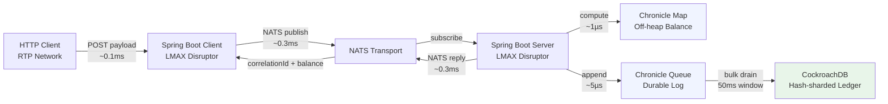

# .github/instructions/pitch.instructions.md

## Pitch Assets — README, PITCH.md, ARCHITECTURE.md

### Audience
Senior bank technology leaders, not engineers.
They will ask: "Does it work?", "Why these tools?", "What's the risk?", "What's next?"
Every document must answer one of those four questions directly.

### Engineering Baseline Note
When referencing implementation choices, assume Java 21 + Spring Boot 3.2 + Lombok.
Lombok should be framed as boilerplate reduction, not an architectural differentiator.

---

## README.md (root)

Tone: confident, concrete, scannable. No jargon without a one-line explanation.
A senior should be able to open it, understand the problem and solution in 60 seconds,
and run the demo in 5 minutes.

### Required Sections

**1. The Problem**
> RTP networks like Interac e-Transfer and real-time payment rails deliver micro-transactions
> at burst rates that traditional ledger systems cannot absorb. A single Apple Pay merchant
> account may receive 500 transactions in 2 seconds during a peak event. Serialising these
> through a conventional JDBC stack creates queuing that breaks RTP SLAs.

**2. This Prototype**
Three bullet points max. What it demonstrates, not how it works.

**3. Architecture Diagram**
Mermaid flowchart with latency annotations at each hop:


**4. Technology Rationale** (one line each)
| Technology | Why |
|------------|-----|
| LMAX Disruptor | Lock-free ring buffer — 25M+ events/sec, eliminates queue contention |
| NATS | Sub-millisecond pub/sub transport, no persistence overhead on hot path |
| Chronicle Map | Off-heap balance store — zero GC pressure, per-account compute lock |
| Chronicle Queue | Crash-safe durable log — tail pointer recovery without Kafka overhead |
| CockroachDB | Hash-sharded ledger — prevents hot ranges on single-account RTP bursts |
| Virtual Threads (simulator) | JDK 21 — 500 concurrent HTTP calls with no thread pool tuning |

**5. Quick Start**
```bash
git clone <repo>
docker compose up -d
./scripts/smoke-test.sh          # verify stack is healthy
open http://localhost:3000        # Grafana — admin/admin
curl -X POST localhost:8082/simulate/apple-pay-burst \
  -H 'Content-Type: application/json' \
  -d '{"accountId":"<seed-uuid>","region":"ca-east","rounds":3}'
```

**6. Key Numbers (prototype targets)**
| Scenario | p95 | p99 |
|----------|-----|-----|
| Warm-up baseline | < 8ms | < 10ms |
| Hot account burst (200 VUs, 1 account) | < 15ms | < 30ms |
| Mixed load (800 VUs, 100 accounts) | < 12ms | < 25ms |
| Balance query (Chronicle Map read) | < 2ms | < 5ms |

**7. Services**
Table: service name, port, what it does, URL

---

## PITCH.md

One page. Answers the five technology questions seniors always ask.
Write as if answering in a meeting — direct, no hedging.

### Questions to Answer

1. **Why not Kafka?**
   Key points: Kafka adds ~5ms broker latency minimum; Chronicle Queue gives us the same
   durability guarantee with sub-microsecond append since it's local disk;
   NATS gives us the pub/sub routing without Kafka's partition management complexity;
   we don't need Kafka's consumer group scaling model here — the Disruptor handles fan-out.

2. **Why not Redis for balance?**
   Key points: Redis requires a network hop (~100µs on LAN, ~1ms cross-AZ);
   Chronicle Map is off-heap local memory — compute() is < 1µs;
   under 500 concurrent writers on one account, Redis serialises through a single thread;
   Chronicle Map's compute() gives us the same serialisation guarantee without the network.

3. **Why not PostgreSQL?**
   Key points: Sequential UUIDs in Postgres create index hotspots under RTP burst load;
   CockroachDB's hash sharding distributes those writes across range replicas automatically;
   geo-aware routing (ca-east/ca-west) maps to CockroachDB locality labels naturally;
   for a prototype this complexity is worth demonstrating — production could use either.

4. **Why LMAX Disruptor?**
   Key points: Designed for financial trading systems (LMAX Exchange — same problem domain);
   cache-line padded ring buffer eliminates false sharing between publisher and consumers;
   mechanical sympathy — predictable memory access patterns reduce CPU cache misses;
   benchmark: 25M+ events/sec on commodity hardware vs ~1M for ArrayBlockingQueue.

5. **What would production add?**
   - NATS JetStream for at-least-once delivery guarantee at the transport layer
   - mTLS between all services
   - Rate limiting per accountId (token bucket in Chronicle Map)
   - Dead-letter Chronicle Queue for failed drain entries
   - Multi-region CockroachDB with locality-aware leaseholder placement
   - Structured audit logging (each LedgerEntry immutable, append-only)
   - Account-level circuit breaker (pause posting if balance compute latency spikes)

---

## ARCHITECTURE.md

For the technical reviewer who wants to understand correctness guarantees.

### Required Sections

1. **Threading Model** — ASCII diagram showing which thread owns each operation,
   with explicit labelling of "this is where the lock is" for Chronicle Map compute()

2. **Balance Correctness Guarantee**
   Explain: Chronicle Map compute() is atomic per key. Under 500 concurrent writers
   to the same accountId, compute() serialises them in arrival order at the Disruptor.
   The Disruptor's single-publisher model means only one EventHandler calls compute()
   at a time per account — no compare-and-swap loop needed.

3. **Recovery Walkthrough** — step by step:
   - Server running normally, tail pointer at index 1,500,000
   - Batch of 400 entries accumulated in drainer, not yet committed
   - JVM crashes
   - On restart: read tail_pointer table → index 1,500,000
   - Seek Chronicle Queue tailer to index 1,500,001
   - Replay 400 entries into next drain cycle
   - CockroachDB UPSERT on ledger_balance is idempotent — no double-count risk

4. **Hot Range Prevention** — why hash sharding matters for this use case specifically.
   Include a diagram showing what happens to CockroachDB range distribution WITHOUT
   hash sharding (all writes land on one range) vs WITH (writes distributed across 8 buckets).

5. **Drain Latency Budget** — why 50ms flush window is the right number:
   50ms × 500 records/batch = effective throughput ceiling = 10,000 TPS into CockroachDB
   Chronicle Queue append is the safety valve — it absorbs any burst above that ceiling
   and the drain catches up during the next lull.
