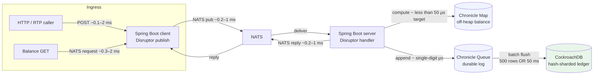

# RTP Ledger

High-speed, low-latency **RTP (Real-Time Payments) transaction aggregation** prototype. A Spring Boot **client** accepts BIAN-style ledger postings over HTTP, fans out through a **LMAX Disruptor** to **NATS**; a **server** applies **Chronicle Map** balance updates, appends to **Chronicle Queue**, and drains asynchronously to **CockroachDB**. The goal is a demonstrable stack with real latency and observability—not a full production system.

**Project memory:** [`CLAUDE.md`](CLAUDE.md) · **Checkpoint tracker:** [`TODO.md`](TODO.md) · **Session bootstrap:** [`LOAD_CONTEXT.md`](LOAD_CONTEXT.md)

---

## The problem

RTP networks deliver micro-transactions at burst rates that conventional ledger stacks struggle to absorb. A single **Apple Pay** or **Google Pay** merchant account can receive hundreds of postings in a few seconds. Serialising that traffic through a typical JDBC-centric path creates queuing that breaks tight RTP SLAs. This repo demonstrates **aggregation onto hot accounts** without giving up a measurable, demo-friendly latency story.

---

## This prototype (what it proves)

- **Accept** BIAN-inspired credit-transfer payloads over HTTP and acknowledge immediately with a **correlation ID** (async ledger completion).
- **Move the hot path off the database**: balances live in **Chronicle Map**; **CockroachDB** receives an asynchronous, batched drain from **Chronicle Queue**.
- **Use mechanical sympathy where it matters**: **LMAX Disruptor** on client and server transaction paths; **NATS** as low-latency transport; **k6** and the built-in **simulator** for repeatable load.
- **Observe end-to-end**: **Prometheus**/**Grafana** (and **VictoriaMetrics** for k6 remote write) so p95/p99 and backlog gauges are visible during a live demo.

---

## Architecture diagram

Latency figures below are **order-of-magnitude targets for this prototype** (local Docker, single node)—not a universal SLA.



**Balance reads:** the client **GET** path issues a NATS request to the server (`ledger.balance.{region}.{accountId}`); the server reads **Chronicle Map** inline (not via the Disruptor). See [`ARCHITECTURE.md`](ARCHITECTURE.md).

---

## Technology rationale

| Technology | Why |
|------------|-----|
| **Java 21 / Spring Boot 3.2** | Mainstream ops profile; structured config and metrics; **Lombok** reduces non-hot-path boilerplate. |
| **LMAX Disruptor** | Lock-free ring buffer; predictable cache behaviour; separates ingress from transport and processing. |
| **NATS** | Sub-millisecond pub/sub; no broker persistence on the hot path; simple subject routing. |
| **Chronicle Map** | Off-heap balances; per-key `compute()` serialisation; no network hop for the working balance. |
| **Chronicle Queue** | Append-only durable log with tail-pointer recovery; drain decouples bursts from DB ingest rate. |
| **CockroachDB** | Hash-sharded PKs reduce single-range hotspots for account-centric writes. |
| **Prometheus / Grafana** | Scraped app metrics + dashboards for demo visibility. |
| **k6 + VictoriaMetrics** | Load scripts with dual remote-write for comparing query paths in Grafana. |
| **Virtual threads (simulator only)** | High concurrency for the load generator without tuning fixed pool sizes. |

---

## Quick start (about five minutes)

From the repository root:

```bash
docker compose -f infra/docker/docker-compose.yml up -d
./scripts/smoke-test.sh
```

Open **Grafana**: [http://localhost:3000](http://localhost:3000) — default login **admin** / **admin**. The RTP Ledger dashboard updates every **5s**.

Optional burst via the simulator (host port **8082**):

```bash
curl -fsS -X POST http://localhost:8082/simulate/apple-pay-burst
```

---

## Running tests

### Smoke test

```bash
./scripts/smoke-test.sh
```

Expect five **POST** responses with **202**, then a non-zero balance on **GET** (defaults: client [http://localhost:18080](http://localhost:18080), region `ca-east`, seeded account UUID).

### k6 (Compose profile `k6`)

Full detail: [`infra/k6/README.md`](infra/k6/README.md).

```bash
# Load test (warm-up, hot account burst, mixed load)
docker compose -f infra/docker/docker-compose.yml --profile k6 run --rm k6 /k6/scripts/rtp_load_test.js

# Concurrency suites (balance correctness | burst | parallel lanes)
docker compose -f infra/docker/docker-compose.yml --profile k6 run --rm -e CONCURRENT_SCENARIO=balance k6 /k6/scripts/rtp_concurrent_test.js
```

### Simulator scenarios

```bash
curl -fsS -X POST http://localhost:8082/simulate/apple-pay-burst
curl -fsS -X POST http://localhost:8082/simulate/google-pay-mixed
curl -fsS -X POST http://localhost:8082/simulate/single-account-drain
curl -fsS http://localhost:8082/simulate/status
```

---

## Flow visualization (client -> NATS -> server/LMAX -> DB)

A metadata-only trace stream now captures stage-by-stage progression for each `correlationId`.

- **Trace subject**: `ledger.trace.v1`
- **Timeline API**: `GET /api/v1/ledger/trace/{correlationId}`
- **Recent API**: `GET /api/v1/ledger/trace/recent`
- **Grafana panels**: RTP Ledger dashboard, **Row 4 — End-to-end flow trace**

Stage sequence for normal posting:

`CLIENT_RING_PUBLISH_OK` -> `CLIENT_HTTP_ACCEPTED` -> `CLIENT_NATS_PUBLISH_OK` -> `SERVER_NATS_RECEIVED` -> `SERVER_RING_ENQUEUED` -> `SERVER_BALANCE_COMPUTE_OK` -> `SERVER_QUEUE_APPEND_OK` -> `DRAINER_BATCH_FLUSH_OK`

Only metadata is included in traces (correlation ID, account ID, amount/currency, status, balances, chronicle index where available).

---

## Key numbers (prototype targets)

| Scenario | p95 (threshold) | p99 (threshold) |
|----------|-----------------|-----------------|
| Warm-up (10 VUs, 30s) | — | **under 8 ms** |
| Hot account burst (200 VUs, one account) | **under 15 ms** | **under 30 ms** |
| Mixed load (up to 800 VUs, 100 accounts) | **under 12 ms** | **under 25 ms** |

**Chronicle Map balance compute:** design target **under 50 µs** on the server hot path (single-threaded handler work per event—measure on your hardware).

**Balance GET** (HTTP → NATS → Chronicle read): typically **low ms** aggregate in Docker; see Micrometer timer `rtp.client.balance.query.latency`.

---

## Services (Docker Compose)

| Service | Host port | Purpose |
|---------|-----------|---------|
| **rtp-client** | **18080** → 8080 | HTTP API: `POST …/post`, `GET …/balance` |
| **rtp-server** | **8081** | Server actuator (health/metrics); NATS subscriber + Chronicle + drainer |
| **rtp-simulator** | **8082** | Load scenarios hitting the client over HTTP |
| **NATS** | **4222** (client), **8222** (monitoring) | Messaging |
| **nats-surveyor** | **7777** | Cluster / surveyor metrics |
| **nats-ui** | **3010** | Optional NATS UI |
| **CockroachDB** | **26257** (SQL), **28080** (admin UI) | Durable ledger + tail pointer |
| **Prometheus** | **9091** → 9090 | Scrapes + remote-write receiver for k6 |
| **VictoriaMetrics** | **8428** | k6 remote-write + VM UI |
| **Grafana** | **3000** | Dashboards |

Compose file: [`infra/docker/docker-compose.yml`](infra/docker/docker-compose.yml). **k6** is an optional profile (`--profile k6`), not started by default.

---

## Configuration reminders

| Concern | Notes |
|---------|--------|
| **CockroachDB** | Server uses **`CRDB_URL`** — never commit credentials. |
| **Chronicle paths** | Map and queue paths from Spring config / env — environment-specific. |
| **Money** | Application balance arithmetic uses **`BigDecimal`**. |

---

## Documentation map

| File | Purpose |
|------|---------|
| [`CLAUDE.md`](CLAUDE.md) | Architecture locks, threading, NATS subjects, data models |
| [`PITCH.md`](PITCH.md) | Why not Kafka / Redis / Postgres—plus production deltas |
| [`ARCHITECTURE.md`](ARCHITECTURE.md) | Threading model, correctness, recovery, sharding narrative |
| [`TODO.md`](TODO.md) | Checkpoint tracker |
| [`infra/k6/README.md`](infra/k6/README.md) | k6 scenarios, concurrency suites, triage |

---

## Development build

```bash
mvn -q -DskipTests compile
```

---

## License

No license file is included in this repository; treat usage as internal or add a `LICENSE` as appropriate for your organization.
